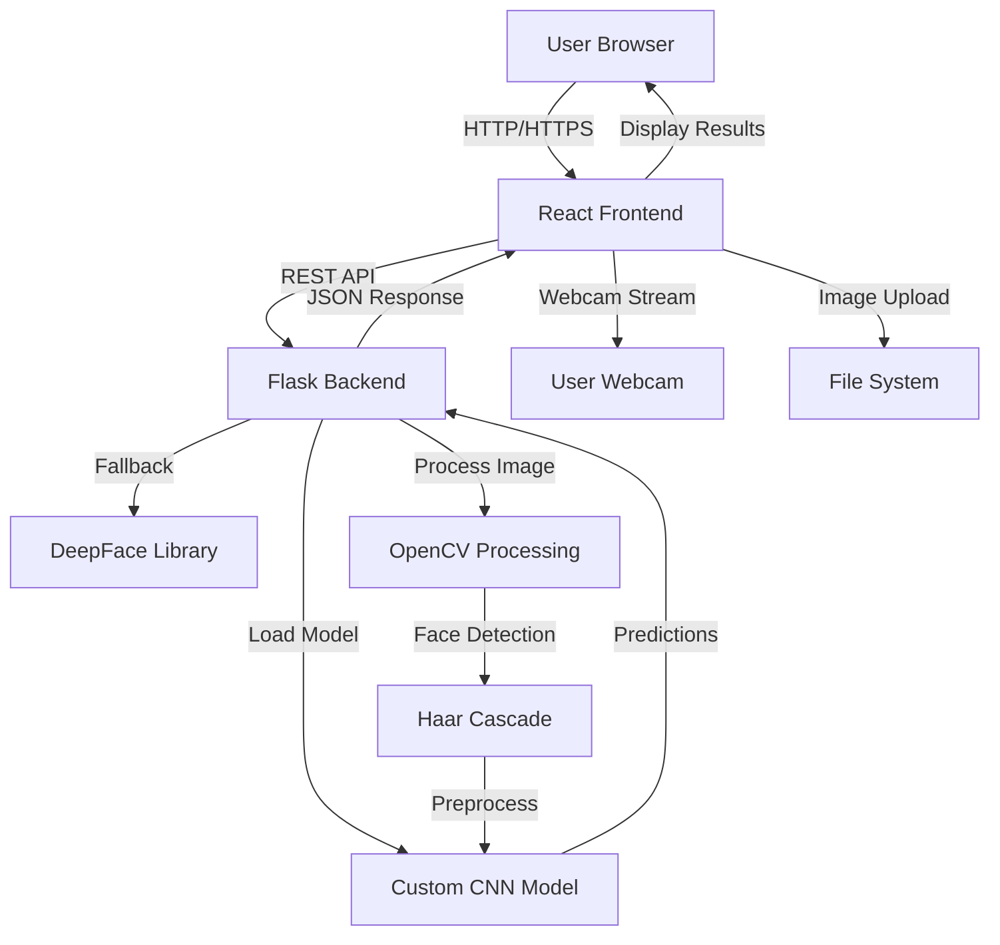
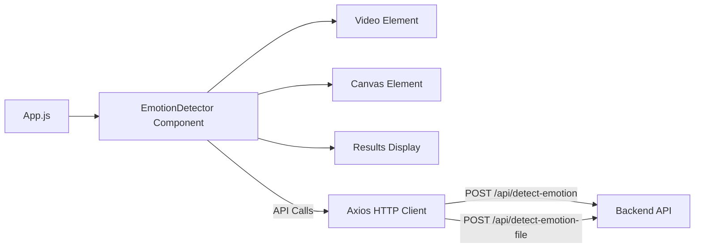
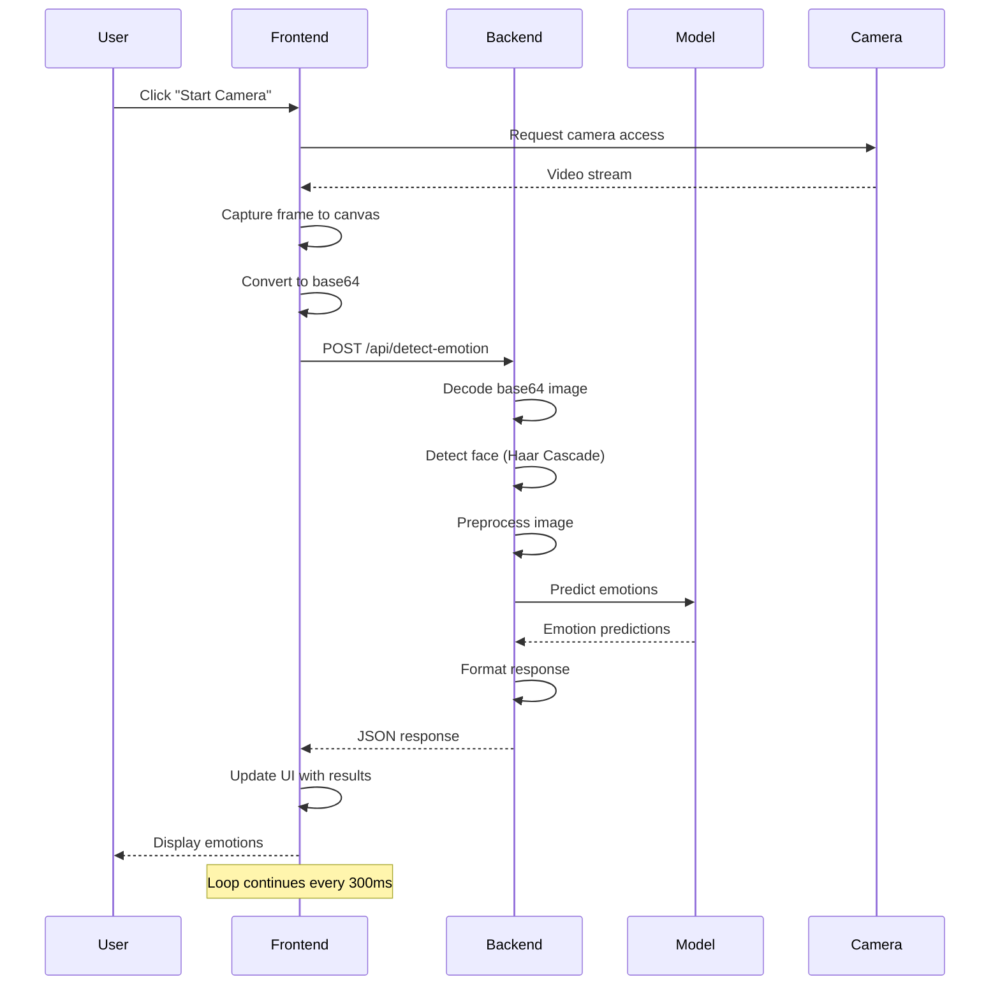
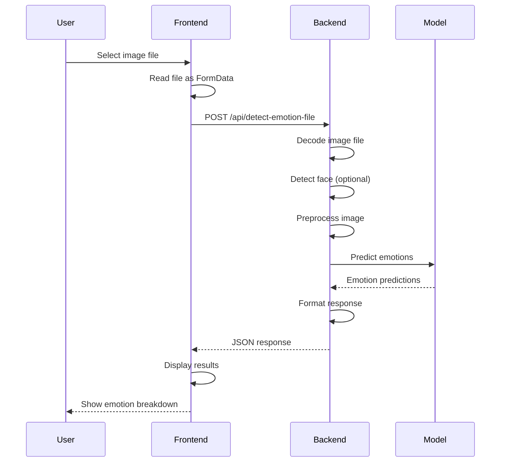
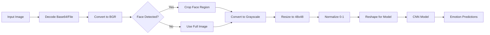
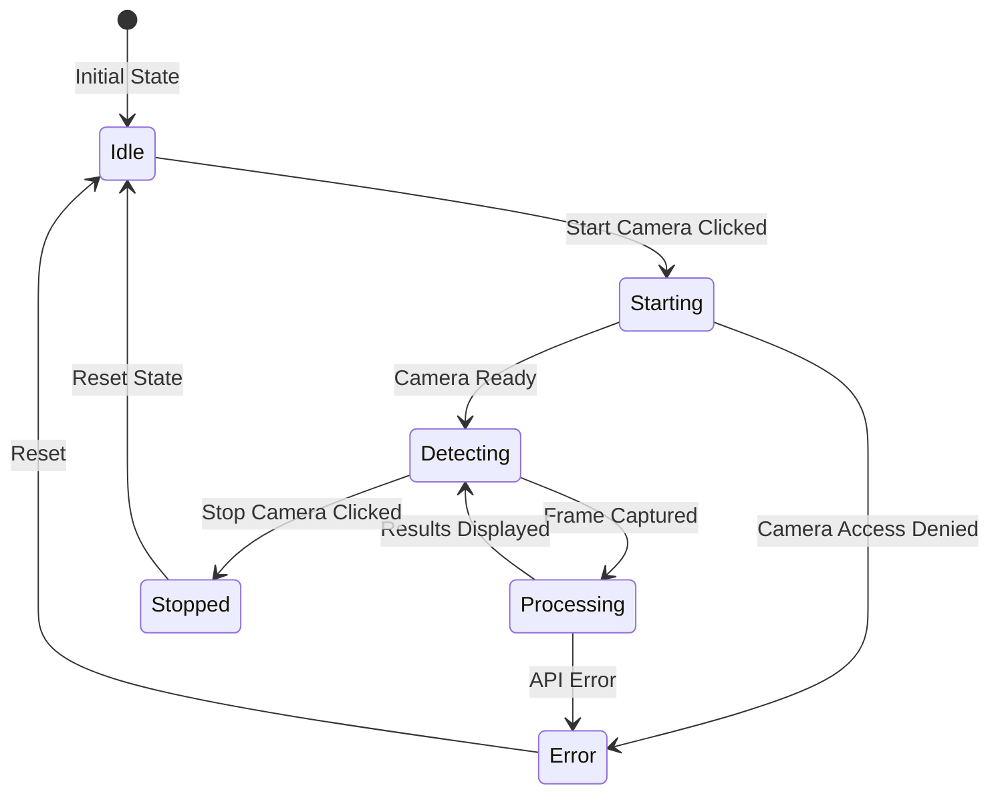
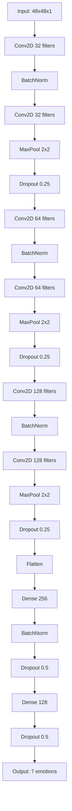

# System Architecture

This document describes the architecture and design of the Autism Emotion Detection system.

## 📋 Table of Contents

- [Overview](#overview)
- [System Architecture](#system-architecture)
- [Component Overview](#component-overview)
- [Data Flow](#data-flow)
- [Backend Architecture](#backend-architecture)
- [Frontend Architecture](#frontend-architecture)
- [Model Integration](#model-integration)
- [Technology Stack](#technology-stack)

## 🏗️ Overview

The Autism Emotion Detection system is a full-stack web application that processes facial images to detect and classify emotions. The system consists of three main components:

1. **Frontend** - React-based web interface
2. **Backend** - Flask REST API server
3. **ML Model** - Custom-trained CNN or DeepFace

## 🎯 System Architecture



## 🔄 Component Overview

### Frontend Components



### Backend Components

```mermaid
graph TB
    FlaskApp[Flask Application] --> Routes[API Routes]
    Routes --> DetectEmotion[/api/detect-emotion]
    Routes --> DetectEmotionFile[/api/detect-emotion-file]
    Routes --> Health[/api/health]
    DetectEmotion --> ImageProcessor[Image Processor]
    DetectEmotionFile --> ImageProcessor
    ImageProcessor --> FaceDetector[Face Detector]
    FaceDetector --> ModelLoader[Model Loader]
    ModelLoader -->|Load| CustomModel[Custom Model]
    ModelLoader -->|Fallback| DeepFaceModel[DeepFace]
    CustomModel --> Predictor[Emotion Predictor]
    DeepFaceModel --> Predictor
    Predictor --> ResponseBuilder[Response Builder]
    ResponseBuilder --> Routes
```

## 📊 Data Flow

### Real-time Camera Detection Flow



### Image Upload Flow



## 🔧 Backend Architecture

### Flask Application Structure

```
backend/
├── app.py                 # Main Flask application
│   ├── load_custom_model()    # Model loading logic
│   ├── detect_face()          # Face detection (Haar Cascade)
│   ├── preprocess_image()     # Image preprocessing
│   ├── predict_with_custom_model()  # Custom model prediction
│   ├── /api/health            # Health check endpoint
│   ├── /api/detect-emotion    # Camera detection endpoint
│   └── /api/detect-emotion-file  # File upload endpoint
└── requirements.txt        # Python dependencies
```

### Model Loading Strategy

The backend uses a multi-path model loading strategy:

1. **Primary**: Try loading `models/final_model.h5`
2. **Fallback**: Try loading `models/best_model.h5`
3. **DeepFace**: If no custom model found, use DeepFace library

### Image Processing Pipeline



## ⚛️ Frontend Architecture

### React Component Structure

```
frontend/src/
├── App.js                    # Main application component
├── components/
│   └── EmotionDetector.js    # Main emotion detection component
│       ├── State Management
│       │   ├── isDetecting   # Camera detection state
│       │   ├── emotion       # Dominant emotion
│       │   ├── emotions      # All emotion scores
│       │   └── error         # Error messages
│       ├── Refs
│       │   ├── videoRef      # Video element reference
│       │   ├── canvasRef     # Canvas element reference
│       │   └── streamRef     # Media stream reference
│       ├── Functions
│       │   ├── startCamera()      # Initialize webcam
│       │   ├── stopCamera()       # Stop webcam
│       │   ├── detectEmotion()    # Detection loop
│       │   └── handleFileUpload() # File upload handler
│       └── UI Components
│           ├── Video Display
│           ├── Results Display
│           └── Controls
└── index.js                  # React entry point
```

### State Management Flow



## 🤖 Model Integration

### Custom Model Architecture

The custom CNN model follows this architecture:



### Model Input/Output

- **Input**: Grayscale image, 48x48 pixels, normalized (0-1)
- **Output**: 7 emotion probabilities (softmax)
- **Emotions**: angry, disgusted, fearful, happy, neutral, sad, surprised

### Model Loading and Inference


## 🛠️ Technology Stack

### Frontend Technologies

| Technology | Version | Purpose |
|------------|---------|---------|
| React | 18.2.0 | UI framework |
| Tailwind CSS | 3.3.6 | Styling |
| Axios | 1.6.0 | HTTP client |
| React Scripts | 5.0.1 | Build tools |

### Backend Technologies

| Technology | Version | Purpose |
|------------|---------|---------|
| Flask | 2.3.0+ | Web framework |
| Flask-CORS | 4.0.0+ | CORS handling |
| TensorFlow | 2.10.0+ | ML framework |
| OpenCV | 4.6.0+ | Image processing |
| NumPy | 1.21.0+ | Numerical operations |
| DeepFace | 0.0.79+ | Fallback emotion detection |

### ML/AI Technologies

| Technology | Purpose |
|------------|---------|
| TensorFlow/Keras | Model training and inference |
| OpenCV Haar Cascades | Face detection |
| Custom CNN | Emotion classification |
| DeepFace | Pre-trained emotion detection (fallback) |

## 🔐 Security Considerations

- **CORS**: Enabled for frontend-backend communication
- **Input Validation**: Image format and size validation
- **Error Handling**: Graceful error handling and fallbacks
- **Model Security**: Model files stored locally, not exposed via API

## 📈 Performance Considerations

- **Model Loading**: Models loaded once at startup
- **Image Processing**: Efficient preprocessing pipeline
- **API Response**: Optimized JSON responses
- **Frontend**: Frame rate limited to ~3-4 FPS for API calls
- **Caching**: Model predictions cached in memory

## 🔗 Related Documentation

- [Usage Guide](04-usage-guide.md) - How to use the system
- [API Reference](06-api-reference.md) - API documentation
- [Model Information](08-model-information.md) - Model details
- [Development Guide](10-development.md) - Development setup

---

**Next**: Learn how to use the system in the [Usage Guide](04-usage-guide.md)

